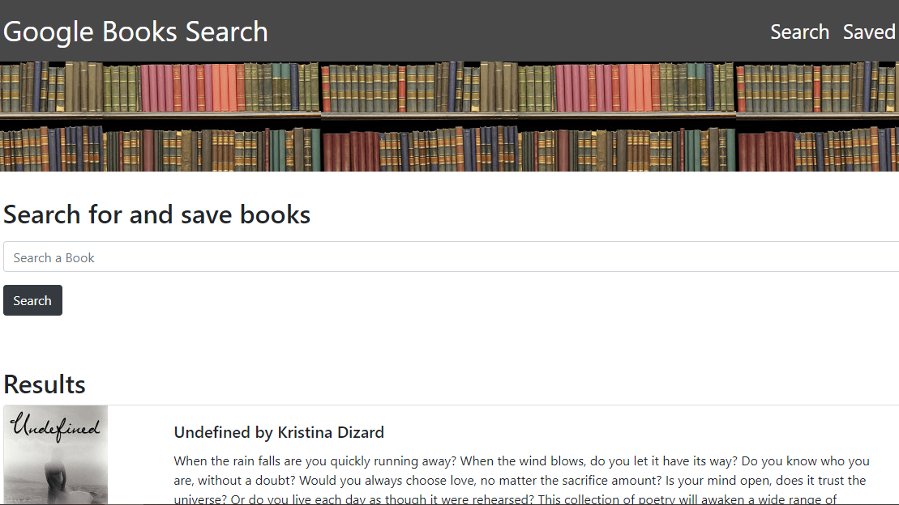

# Google Book Search

## Overview
In this activity, create a new React-based Google Books Search app. This app construction used React components, helper/util functions, and utilized React lifecycle methods to query and display books based on user searches. Also use Node, Express and MongoDB so that users can save books to review or purchase later.

## Deployed Link
* *Heroku: https://enigmatic-badlands-56295.herokuapp.com/*

## Technical Requirements
* Javascript
* React.js
* JSX
* Express/Node.js
* MongoDB/Mongoose
